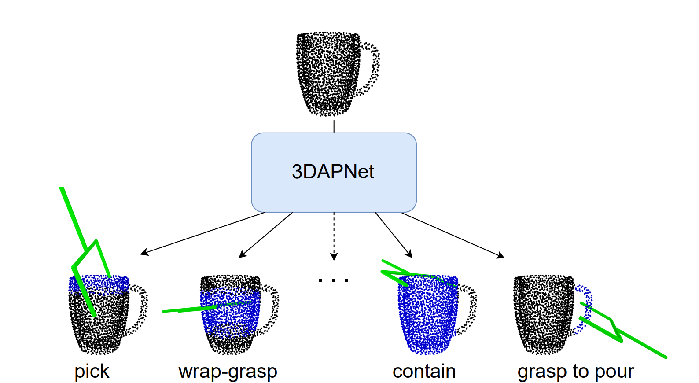
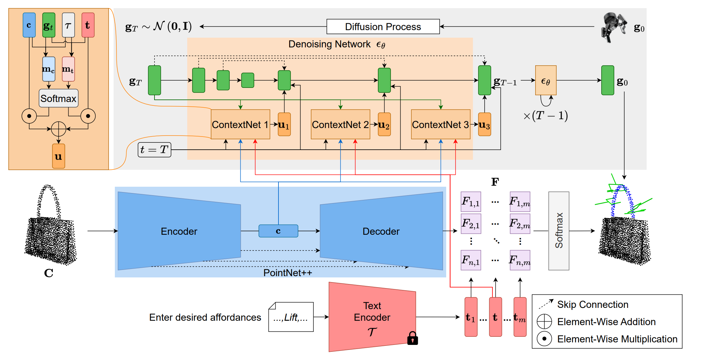
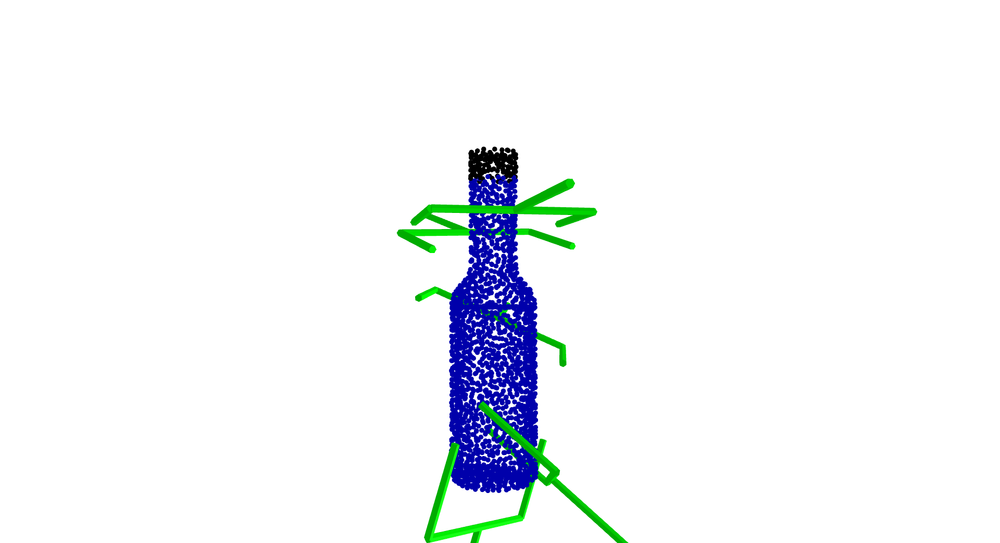

<div align="center">

# Language-Conditioned Affordance-Pose Detection in 3D Point Clouds

[](https://2024.ieee-icra.org/)
[](https://ieeexplore.ieee.org/abstract/document/10610008/)

Official code for the ICRA 2024 paper "Language-Conditioned Affordance-Pose Detection in 3D Point Clouds".



We address the task of language-driven affordance-pose detection in 3D point clouds. Our method simultaneously detect open-vocabulary affordances and
generate affordance-specific 6-DoF poses.



We present 3DAPNet, a new method for affordance-pose joint learning. Given the captured 3D point cloud of an object and a set of affordance labels conveyed through natural language texts, our objective is to jointly produce both the relevant affordance regions and the appropriate pose configurations that facilitate the affordances.

</div>


## 1. Getting Started
We strongly encourage you to create a separate conda environment.

    conda create -n affpose python=3.8
    conda activate affpose
    conda install pip
    pip install -r requirements.txt

## 2. Dataset
Our 3DAP dataset is available at [this drive folder](https://drive.google.com/drive/folders/1vDGHs3QZmmF2rGluGlqBIyCp8sPR4Yws?usp=sharing).

## 3. Training
Current framework supports training on a single GPU. Followings are the steps for training our method with configuration file ```config/detectiondiffusion.py```.

* In ```config/detectiondiffusion.py```, change the value of ```data_path``` to your downloaded pickle file.
* Change other hyperparameters if needed.
* Run the following command to start training:

		python3 train.py --config ./config/detectiondiffusion.py

## 4. Open-Vocabulary Testing
Executing the following command for testing of your trained model:

    python3 detect.py --config <your configuration file> --checkpoint <your  trained model checkpoint> --test_data <test data in the 3DAP dataset>

Note that we current generate 2000 poses for each affordance-object pair.
The guidance scale is currently set to 0.5. Feel free to change these hyperparameters according to your preference.

The result will be saved to a ```result.pkl``` file.

## 5. Visualization
To visuaize the result of affordance detection and pose estimation, execute the following script:

                python3 visualize.py --result_file <your result pickle file>

Example of visualization:



## 6. Citation

If you find our work useful for your research, please cite:
```
@inproceedings{Nguyen2024language,
      title={Language-Conditioned Affordance-Pose Detection in 3D Point Clouds},
      author={Nguyen, Toan and Vu, Minh Nhat and Huang, Baoru and Van Vo, Tuan and Truong, Vy and Le, Ngan and Vo, Thieu and Le, Bac and Nguyen, Anh},
      booktitle = ICRA,
      year      = {2024}
}
```
Thank you very much.